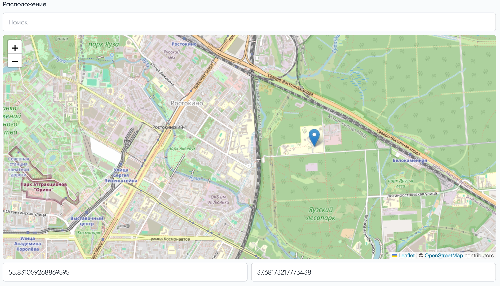

# Поле для выбора точки на карте и сохраненя координат, использует LeafLet

## Установка
```shell
composer require gian_tiaga/moonshine-coordinates
```

## Использование

1) Добавьте в миграцию поле с координатами 
```php
$table->json('coordinates')->nullable();
```
2) Добавьте в свою модель `cast`
```php
use GianTiaga\MoonshineCoordinates\Casts\CoordinatesCast;

// ...code

/**
 * @return array<string, string>
 */
protected function casts(): array
{
    return [
        'coordinates' => CoordinatesCast::class,
    ];
}
```
3) Используйте поле в своём ресурсе
```php
use GianTiaga\MoonshineCoordinates\Dto\CoordinatesDto;
use GianTiaga\MoonshineCoordinates\Fields\Coordinates;

// ...code

Coordinates::make('Расположение', 'coordinates')
    ->center(new CoordinatesDto(
        latitude: 55.7505412, 
        longitude: 37.6174782
    ))
    ->zoom(10), 
```
## Как выглядит

